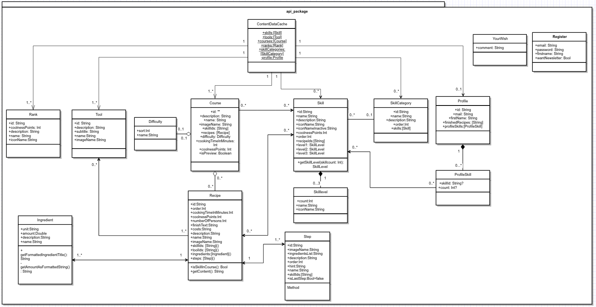
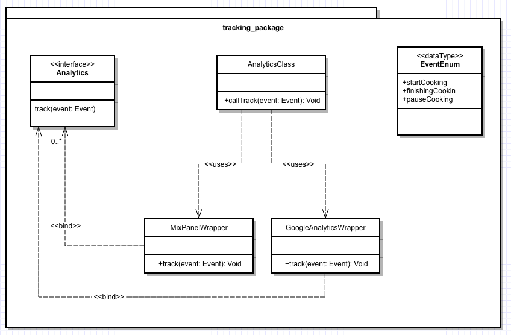

# Aufgabe 1  UML 

## Deployment Diagram (Verteilungsdiagram)
Die folgende HTML zeigt, die Verteilung von verschiedenen Mein KochWerk Instanzen
- [Link zum Anzeigen der HTML im Browser](https://stirnraten.de/softwaretechnik/deployment_diagram.html)
- [Sourcecode](deployment_diagram.html)

## Klassendiagramm 
Das originale Klassendiagramm liegt leider nur als gliffy vor.
- [Gliffy File SourceCode](klassendiagramm.gliffy)

### Klassenstruktur im api_package
- [Link zum Öffnen des Bildes im Browser](https://stirnraten.de/softwaretechnik/api_package.png)

### Klassenstruktur im tracking_package
- [Link zum Öffnen des Bildes im Browser](https://stirnraten.de/softwaretechnik/tracking_package.png)

