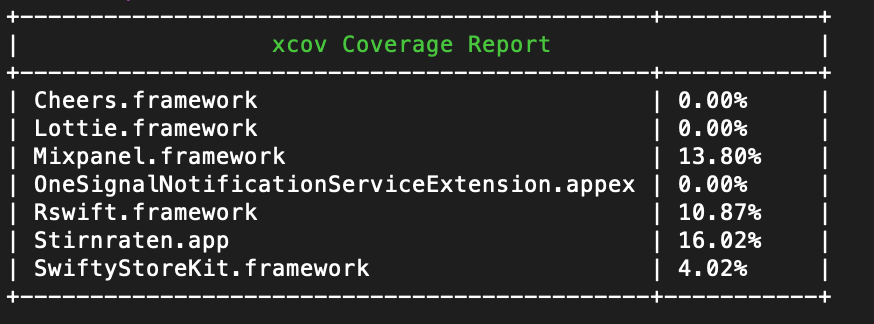
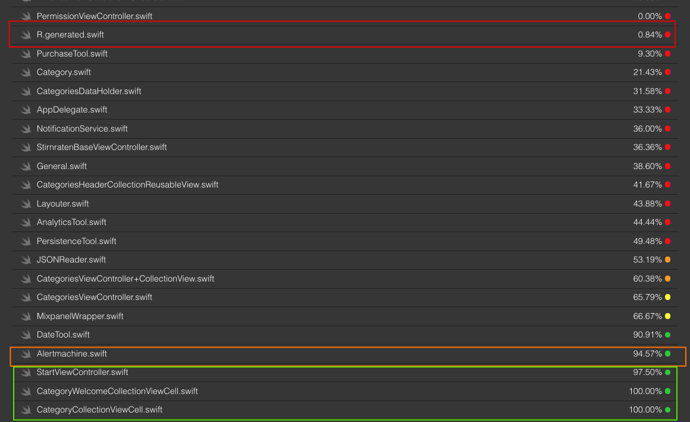
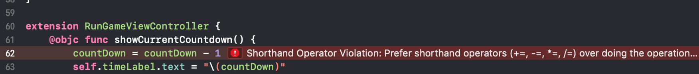
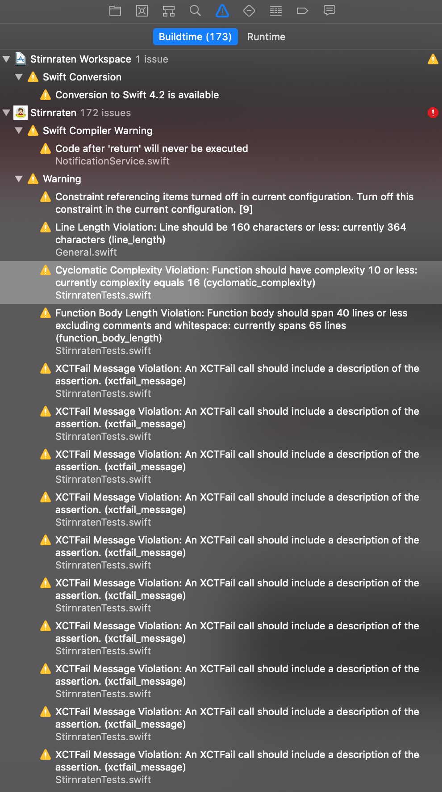

# Metriken 

Im Folgenden wird meine iOS-App [Stirnraten](https://stirnraten.de/) untersucht auf
- Lines of Code
- Testabdeckung
- Unbenutzer Code
- Swift Linter (Code Style Checker)


## Testabdeckung

Verwendetes Tool: [XCov](https://github.com/nakiostudio/xcov). Dieses Tool wertet von XCode (Apples IDE) erstellte Test-Logs aus und stellt die Coverage in Form einer .html grafisch dar.



In dem Screenshots wird ebenfalls die Testabdeckung von verwendeten Dritt-Frameworks angezeigt (z.B. Lottie), erkennbar durch das `.framework`. Relevant ist eigentlich nur die `Stirnraten.app`. Mit ca. 16 % ist die Testabdeckung natürlich nicht wirklich berauschend. 

Was XCov testet, findet sich in einer detaillierten HTML, siehe [hier](https://stirnraten.de/softwaretechnik/metriken/xcov_output/)
Originaler [Sourcecode](xcov_output)


Was man bei diesen Tests wissen muss: Damit Unittests ausgeführt werden können, muss die App initialisiert werden. Sobald die App läuft werden auch alle Methoden ausgeführt, welche beim regulären Appstart gestartet werden. Obwohl es keinerlei Unittests für gewissen Klassen gibt, können so 100 % Abdeckungen enstehen (siehe grünen Kasten). 

D.h. das Ergebnis ist ein wenig trügerisch. Es wird dementsprechend nur gezeigt, wie viel Methoden von den jeweiligen Klassen ausgeführt wird. Man kann nicht sehen, wie viel ausgeführter Code tatsächlich durch Unittests abgedeckt ist. Insgesamt ist dies für mich eher enttäuschend. 

## Lines of Code

Das Projekt hat `4954`  Lines of Code. Wobei es klassischerweise schwierig ist, zu beurteilen, was diese Zahl aussagt. 🤷‍♂️
Ein Swift-Linter sagt, dass eine `*.swift` nicht länger als 400 Zeilen sein sollte. Dies trifft auf alle Files zu.
Ein weiterer Richtwert ist, dass ein Swift-ViewController nicht mehr als 175 Zeilen haben sollte. 

Bis auf den RungameViewController sind alle ViewController in diesem Limit. 
```288 ./ViewControllers/ViewController/Main/RunGameViewController/RunGameViewController.swift```  
Bei einer Analyse ergab sich, dass der `RungameViewController` tatsächlich unsauber entwickelt ist und an einigen Stellen das MVC Pattern verletzt, da zu viel Spiellogik im View liegt. Ich habe mir ein Ticket erstellt.  

Shell Command for Lines Of Code
```find . -path ./Pods -prune -o -name "*.swift" -print0 ! -name "/Pods" | xargs -0 wc -l```

Result
```
28 ./Xibs/RatingView.swift
28 ./Xibs/ForwardingView.swift
25 ./ViewController.swift
78 ./Tools/General.swift
105 ./Tools/PurchaseTool.swift
45 ./Tools/Rating.swift
379 ./Tools/Alerts/AlertmachinePresenter.swift
13 ./Tools/Alerts/AlertTypes.swift
138 ./Tools/Alerts/Alertmachine.swift
13 ./Tools/Alerts/PersistenceKeys.swift
36 ./Tools/Alerts.swift
166 ./Tools/Layouter.swift
97 ./Tools/AnimationTool.swift
25 ./Tools/DateTool.swift
119 ./Tools/PersistenceTool.swift
79 ./Tools/SoundTool.swift
26 ./Categories.swift
19 ./Extensions/UIImageViewExtension.swift
80 ./Extensions/DeviceExtensions.swift
21 ./Extensions/BundleExtensions.swift
15 ./Extensions/DateExtension.swift
15 ./ViewControllers/BaseViewController/BaseNavigationViewController.swift
86 ./ViewControllers/BaseViewController/StirnratenBaseViewController.swift
38 ./ViewControllers/ViewController/Settings/PageViewControllers/StepViewController.swift
54 ./ViewControllers/ViewController/Settings/PageViewControllers/HelpPageViewController.swift
81 ./ViewControllers/ViewController/Settings/PageViewControllers/HelpPageViewController+UIPageDataSource.swift
104 ./ViewControllers/ViewController/Settings/ThemeViewController/ThemeViewController+TableView.swift
17 ./ViewControllers/ViewController/Settings/ThemeViewController/ThemesViewController+ButtonAction.swift
37 ./ViewControllers/ViewController/Settings/ThemeViewController/ThemesViewController.swift
28 ./ViewControllers/ViewController/Settings/SettingsViewController/SettingsViewController+ButtonAction.swift
177 ./ViewControllers/ViewController/Settings/SettingsViewController/SettingsViewController.swift
148 ./ViewControllers/ViewController/Shop/ShopViewController/ShopViewController+TableView.swift
71 ./ViewControllers/ViewController/Shop/ShopViewController/ShopViewController.swift
86 ./ViewControllers/ViewController/Main/RandomViewController/RandomViewController.swift
50 ./ViewControllers/ViewController/Main/RandomViewController/RandomViewController+PanGesture.swift
16 ./ViewControllers/ViewController/Main/RandomViewController/RandomViewController+ButtonAction.swift
147 ./ViewControllers/ViewController/Main/RandomViewController/RandomViewController+CollectionView.swift
22 ./ViewControllers/ViewController/Main/PremiumViewController/PremiumViewController+ButtonAction.swift
136 ./ViewControllers/ViewController/Main/PremiumViewController/PremiumViewController.swift
121 ./ViewControllers/ViewController/Main/FinishViewController/FinishViewController.swift
16 ./ViewControllers/ViewController/Main/FinishViewController/FinishViewController+MailDelegate.swift
22 ./ViewControllers/ViewController/Main/FinishViewController/FinishViewController+ButtonAction.swift
46 ./ViewControllers/ViewController/Main/FinishViewController/FinishViewController+TableView.swift
23 ./ViewControllers/ViewController/Main/FinishViewController/FinishedViewController+Cheers.swift
32 ./ViewControllers/ViewController/Main/RunGameViewController/RunGameViewController+ButtonActions.swift
288 ./ViewControllers/ViewController/Main/RunGameViewController/RunGameViewController.swift
71 ./ViewControllers/ViewController/Main/CategoriesViewController/CategoriesViewController.swift
159 ./ViewControllers/ViewController/Main/CategoriesViewController/CategoriesViewController+CollectionView.swift
15 ./ViewControllers/ViewController/Main/RunGameNavigationController/RunGameNavigationController.swift
41 ./ViewControllers/ViewController/Main/PermissionViewController/PermissionViewController.swift
77 ./ViewControllers/ViewController/Main/StartVIewController/StartViewController.swift
40 ./ViewControllers/ViewController/Imprint/LicensesViewController/LicensesViewController.swift
39 ./ViewControllers/ViewController/Imprint/LicensesViewController/LicensesViewController+TableView.swift
26 ./ViewControllers/ViewController/Imprint/ImprintViewController/ImprintViewController.swift
16 ./ViewControllers/ViewController/Imprint/ImprintViewController/ImprintViewController+ButtonAction.swift
69 ./API/JSONReader.swift
45 ./API/Model/Category.swift
34 ./API/Model/CategoriesDataHolder.swift
46 ./AppDelegate.swift
18 ./Views/Cells/ShoppingMoreTableViewCell.swift
15 ./Views/Cells/ShoppingMessageCell.swift
22 ./Views/Cells/BaseCollectionViewCells/StirnratenCollectionViewCell.swift
16 ./Views/Cells/ThemeLabelTableViewCell.swift
24 ./Views/Cells/ShoppingTimboTableViewCell.swift
20 ./Views/Cells/CategoryWelcomeCollectionViewCell.swift
25 ./Views/Cells/CategoryCollectionViewCell.swift
21 ./Views/Cells/RandomCollectionViewCell.swift
36 ./Views/Cells/ShoppingTableViewCell.swift
15 ./Views/Cells/FinishRightWordTableViewCell.swift
20 ./Views/Cells/RandomWelcomeCollectionViewCell.swift
14 ./Views/Cells/FinishWrongWordTableViewCell.swift
14 ./Views/Cells/ShoppingMessageTableViewCell.swift
14 ./Views/Cells/ImpressumButtonCollectionViewCell.swift
34 ./Views/ReusableView/RandomHeaderCollectionReusableView.swift
36 ./Views/ReusableView/CategoriesHeaderCollectionReusableView.swift
22 ./Views/Button/IconButton.swift
17 ./Views/Button/RoundButton.swift
55 ./Views/Button/LoadingButton.swift
39 ./Services/Notifications/OneSignalNotifcationExtension.swift
60 ./Services/Notifications/NotificationService.swift
48 ./Services/Notifications/OneSignalService.swift
17 ./Services/Analytics/AnalyticsDelegate.swift
48 ./Services/Analytics/MixpanelWrapper.swift
14 ./Services/Analytics/CustomerEvent.swift
36 ./Services/Analytics/AnalyticsTool.swift
50 ./Services/Analytics/TrackingEvent.swift
20 ./Internal Models/ShoppingElement.swift
20 ./Internal Models/UsedWord.swift
16 ./Internal Models/GuessedWords.swift
26 ./Internal Models/ShoppingItem.swift
16 ./Internal Models/New Group/ThirdParty.swift
15 ./Internal Models/New Group/ThirdpartyLicense.swift
17 ./Internal Models/CategoryHolder.swift
4954 total
```


## Unbenutzer/Redundanter Code

Da XCode (Apples IDE für Swift/Objectiv C) relativ schwach ist, was Redundanz, unnötige Importe, unsued Code usw. ist, setze ich die [PeripheryApp](https://peripheryapp.com/documentation/getting-started/)  ein.


Die folgenden Zeilen zeigen Code, welcher nicht verwendet wird und gelöscht werden sollte. 
```
/Users/michaelrothkegel/StirnratenIOS/Stirnraten/Extensions/BundleExtensions.swift:15:9: warning: Property 'buildVersionNumber' is unused
/Users/michaelrothkegel/StirnratenIOS/Stirnraten/Extensions/BundleExtensions.swift:18:9: warning: Property 'releaseVersionNumberPretty' is unused
/Users/michaelrothkegel/StirnratenIOS/Stirnraten/Internal Models/CategoryHolder.swift:15:9: warning: Property 'randomCategories' is unused
/Users/michaelrothkegel/StirnratenIOS/Stirnraten/Internal Models/GuessedWords.swift:14:9: warning: Property 'lastTimeUsed' is unused
/Users/michaelrothkegel/StirnratenIOS/Stirnraten/Internal Models/GuessedWords.swift:15:9: warning: Property 'failedToGetANewWord' is unused
/Users/michaelrothkegel/StirnratenIOS/Stirnraten/Services/Analytics/MixpanelWrapper.swift:14:17: warning: Property 'mixpanelLiveToken' is unused
/Users/michaelrothkegel/StirnratenIOS/Stirnraten/Services/Notifications/NotificationService.swift:15:10: warning: Function 'sendTag(key:value:)' is unused
/Users/michaelrothkegel/StirnratenIOS/Stirnraten/Services/Notifications/NotificationService.swift:53:10: warning: Function 'sendTag(key:value:)' is unused
/Users/michaelrothkegel/StirnratenIOS/Stirnraten/Services/Notifications/OneSignalNotifcationExtension.swift:13:7: warning: Class 'OneSignalPushService' is unused
/Users/michaelrothkegel/StirnratenIOS/Stirnraten/Services/Notifications/OneSignalService.swift:43:10: warning: Function 'sendTag(key:value:)' is unused
/Users/michaelrothkegel/StirnratenIOS/Stirnraten/Tools/Alerts.swift:22:17: warning: Function 'showYesNoAlert(vc:title:message:completion:)' is unused
/Users/michaelrothkegel/StirnratenIOS/Stirnraten/Tools/Alerts/AlertmachinePresenter.swift:53:18: warning: Function 'setSkipPremiumTime()' is unused
/Users/michaelrothkegel/StirnratenIOS/Stirnraten/Tools/General.swift:15:17: warning: Function 'openMail(email:)' is unused
/Users/michaelrothkegel/StirnratenIOS/Stirnraten/Tools/General.swift:38:17: warning: Function 'getRandomIcon()' is unused
/Users/michaelrothkegel/StirnratenIOS/Stirnraten/Tools/HapticTool.swift:28:17: warning: Function 'heavy()' is unused
/Users/michaelrothkegel/StirnratenIOS/Stirnraten/Tools/HapticTool.swift:37:17: warning: Function 'medium()' is unused
/Users/michaelrothkegel/StirnratenIOS/Stirnraten/Tools/HapticTool.swift:55:17: warning: Function 'callSelectionHaptic()' is unused
/Users/michaelrothkegel/StirnratenIOS/Stirnraten/Tools/HapticTool.swift:75:17: warning: Function 'taskWarning()' is unused
/Users/michaelrothkegel/StirnratenIOS/Stirnraten/Tools/Layouter.swift:122:10: warning: Function 'getTextOnTransparence()' is unused
/Users/michaelrothkegel/StirnratenIOS/Stirnraten/Tools/Layouter.swift:142:10: warning: Function 'getButtonIcon()' is unused
/Users/michaelrothkegel/StirnratenIOS/Stirnraten/ViewControllers/BaseViewController/StirnratenBaseViewController.swift:18:9: warning: Property 'categoryHolder' is unused
/Users/michaelrothkegel/StirnratenIOS/Stirnraten/ViewControllers/ViewController/Main/FinishViewController/FinishViewController.swift:22:9: warning: Property 'rating' is unused
/Users/michaelrothkegel/StirnratenIOS/Stirnraten/ViewControllers/ViewController/Settings/PageViewControllers/HelpPageViewController.swift:26:9: warning: Property 'currentIndex' is unused
```

## Swift Linter

Das Projekte hatte vor dem Code Style Check drei Warnungen. Der implentierte [Swift Linter](https://github.com/realm/SwiftLint) hat dafür gesorgt, dass das Projekt nicht mehr kompiliert hat, da es einige grobe Code-Style-Verstöße gab. Zusätzlich wurden > 400 Warnungen geworfen.




Inzwischen sind die Warnungen auf 100 reduziert.


