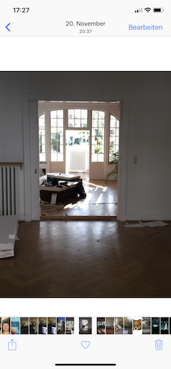

# Usability Guidelines

Im folgenden Abschnitt werden meine Top15 Clean Code Guidelines vorgestellt

## 1. Near to Thumb 

Je nach Telefongröße sind Flächen unterschiedlich gut/schlecht erreichbar. Statistisch gesehen halten Menschen das Telefon eher in der rechten Hand. Die folgende Grafik stellt dar, wo man präsente Aktionen am besten positionieren sollte. 

## 2. Progressive Disclosure

Beim progressive disclosure werden immer nur die Inhalte angezeigt, welche für den Benutzer in dem Moment benötigt werden könnten.
Bild 1 zeigt gängige Funktionen an, wenn man Bilder durchguckt. Auf Bild 2 wurde auf 'Bearbeiten' gedrückt und dementsprechend werden nur Funktionen angezeigt, welche dazu dienen, Bildveränderungen durchzuführen.

## 3. Plattformspezifisch bleiben
Man sollte das Rad nicht neu erfinden, gerade wenn es bereits etablierte Darstellungen gibt, die jeder versteht. Im europäsisch/westlichen Raum rechnet niemand damit, einen Text von rechts nach links zu lesen. Nicht anders ist es im Bezug auf Appbenutzung.

Genauer betrifft das:
- Navigationsstrukturen
- Plattformspezifische Gesten, Transitionen, UI Elemente
- Menugestaltung 

## 4. Bei Namensgebung an die Konventionen halten

Ähnlich wie Punkt 3: Etablierte Namensgebungen, wie z.B. der 'Warenkorb', 'Login', 'Buchungen' sollten genau so genannt werden.
❌ Don't: Einkaufstasche, Eintreten, Vergangenes 
✅ Do: Warenkorb, Login, Buchungen

## 5. Einheitliche Schriftarten/größen und Farben

Weniger ist mehr: In der Regel reicht eine Schriftart. Unterschieden wird durch Größe (Titel > Subtitle > Inhalt) sowie Formatierungen wie z.B. _kursiv_, *bold* oder __unterstrichene__ (Indikatoren für Links).  

## 6. Keyboards an Anwendungsfall anpassen
Zeige dem Benutzer das Keyboard an, welches er gerade benötigt. 

## 7. Defaults setzen
Hilf dem Benutzer durch Defaultwerte unnötige Klicks zu vermeiden. Wurde die Postleitzahl angegeben, ist Stadt und Land eindeutig. Hat der Benutzer bereits ein Geschlecht ausgewählt, ist die Anrede klar. 

## 8. Call to Action
Präsentiere Aktionen Prominent und fordere den Benutzer indirekt auf, diese Aktion durchzuführen.

## 9. Klickbare Elemente markieren
Markiere klickbare Elemente eindeutig. 

## 10. Bilder sagen mehr als 1000 Worte
Im echten Leben sieht man es häufig, dass Bilder besser kommunzieren, als ein geschriebener Satz. Beispiele dafür wären Verbotsschilder (z.B. ein durchgestrichenes Eis) oder Straßenschilder (Ein Warnschild mit einem Auto und Schlieren).

Dieses Prinzip funktioniert auch für Webseiten und Apps. 

