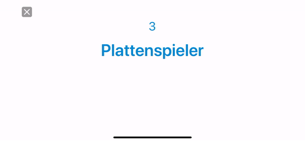

# Clean Code - Spielausschnitt 
Es handelt sich um ein Ausschnitt des Spieles Stirnraten: In diesem Spiel muss der Spieler möglichst viele Begriffe innerhalb von 30 Sekunden erraten, welche ihm von Mitspielern erklärt werden.

In dem folgenden Gif wurden bereits zahlreiche Begriffe erraten und die Zeit läuft ab. Die Logik zum Anzeigen des Endscreens steckt im `FinishViewController` und wurde nach besten Wissen und Gewissen nach Clean Code Guidelines umgesetzt. 



```swift
//
//  FinishViewController.swift
//  Stirnraten
//
//  Created by Michael Rothkegel on 16.08.18.
//  Copyright © 2018 Michael Rothkegel. All rights reserved.
//

import UIKit
import Cheers
import MessageUI

class FinishViewController: StirnratenBaseViewController {
    // MARK: - views
    // tableviews
    @IBOutlet weak var wrongWordsTableView: UITableView!
    @IBOutlet weak var rightWordsTableView: UITableView!

    //label
    @IBOutlet weak var sumOfPointsLabel: UILabel!

    //view
    @IBOutlet weak var sumOfPointsHolderView: UIView!
    
    //buttons
    @IBOutlet weak var againButton: IconButton!
    @IBOutlet weak var abortButton: IconButton!
    
    // MARK: - ui actions
    @IBAction func abortButtonAction(_ sender: Any) {
        analyticsTool.trackEvent(event: .chooseNewCategory)
        dismiss(animated: true, completion: nil)
    }
    
    @IBAction func againButtonAction(_ sender: Any) {
        analyticsTool.trackEvent(event: .repeatGame)
        goToRunGameViewController()
    }
    
    // MARK: - public vars
    var usedWords = [UsedWord]()
    var categoryIds = [Int]()
    var rating = Rating(playedGames: PersistenceTool.loadPlayedGames())
    
    // MARK: - private vars
    private let cheerView = CheerView()
    private var rightWords = [String]()
    private var wrongWords = [String]()
    
    override func viewDidLoad() {
        super.viewDidLoad()
        analyticsTool.trackEvent(event: .finishScreen)
        initTableView()
        initUI()
        runWordsAnimation()
    }
    
    override func viewWillAppear(_ animated: Bool) {
        super.viewWillAppear(animated)
        SoundTool.playSound(type: .endSound)
    }
    
    override func viewDidLayoutSubviews() {
        super.viewDidLayoutSubviews()
        cheerView.frame = view.bounds
    }
}

extension FinishViewController {
    private func initUI() {
        wrongWordsTableView.backgroundColor = UIColor.clear
        rightWordsTableView.backgroundColor = UIColor.clear
        
        sumOfPointsLabel.text = "0"
        sumOfPointsLabel.textColor = Layouter.shared.getTextOnSecondary()
        
        sumOfPointsHolderView.backgroundColor = Layouter.shared.getSecondary()
        sumOfPointsHolderView.layer.cornerRadius = 25
        
        view.backgroundColor = Layouter.shared.getBackground()
    }
    
    private func showCheersAnimation() {
        view.addSubview(cheerView)
        cheerView.config.particle = .confetti(allowedShapes: [Particle.ConfettiShape.triangle])
        cheerView.start()
        
        General.delay(1.5) {
            self.cheerView.stop()
        }
    }
    
    private func showInternalAdvertisment() {
        let playedGames = PersistenceTool.loadPlayedGames()
        let alertMachine = AlertMaschine(games: playedGames, isPremium: hasUserFullAccess(), datetime: Date())
        let rating = Rating(playedGames: playedGames)
        
        if let alertType = alertMachine.getAlertyType() {
            let alertMachinePresenter = AlertMachinePresenter(viewController: self, analyticsTool: analyticsTool, rating: rating)
            alertMachinePresenter.showAlert(alertType: alertType)
        }
    }
    
    private func stopWordsAnimation() {
        PersistenceTool.savePlayedGame()
        
        let escapedString = "{ \"played_games\":\(PersistenceTool.loadPlayedGames()), \"has_premium\":\(hasUserFullAccess()) }"
        analyticsTool.incremet(property: .playedGames, by: 1)
        analyticsTool.setCusomter(property: .hasPremium, to: hasUserFullAccess())
        NotificationService.instance.sendTag(withJsonString: escapedString)
        
        showCheersAnimation()
        showInternalAdvertisment()
    }
    
    private func runWordsAnimation() {
        if usedWords.count == 0 {
            stopWordsAnimation()
            return
        }
        
        guard let usedWord = usedWords.first else {
            return
        }
        usedWords.removeFirst()
        
        if usedWord.isRight {
            rightWordsTableView.beginUpdates()
            rightWords.append(usedWord.word)
            let indexPath = IndexPath(row: rightWords.count-1, section: 0)
            rightWordsTableView.insertRows(at: [indexPath], with: .top)
            rightWordsTableView.endUpdates()
            rightWordsTableView.scrollToRow(at: indexPath, at: .top, animated: true)
            sumOfPointsLabel.text = "\(rightWords.count)"
            SoundTool.playSound(type: .countingFinalRightWords)
        } else {
            wrongWordsTableView.beginUpdates()
            wrongWords.append(usedWord.word)
            let indexPath = IndexPath(row: wrongWords.count-1, section: 0)
            wrongWordsTableView.insertRows(at: [indexPath], with: .top)
            wrongWordsTableView.endUpdates()
            wrongWordsTableView.scrollToRow(at: indexPath, at: .top, animated: true)
        }
        
        DispatchQueue.main.asyncAfter(deadline: .now() + 0.5) {
            self.runWordsAnimation()
        }
    }
  
    private func goToRunGameViewController() {
        if let runGameViewController = R.storyboard.main.runGameViewController() {
            runGameViewController.ids = self.categoryIds
            self.navigationController?.pushViewController(runGameViewController, animated: true)
        }
    }
}

extension FinishViewController: UITableViewDelegate, UITableViewDataSource {
    private func initTableView() {
        rightWordsTableView.delegate = self
        rightWordsTableView.dataSource = self
        wrongWordsTableView.delegate = self
        wrongWordsTableView.dataSource = self
    }
    
    func tableView(_ tableView: UITableView, cellForRowAt indexPath: IndexPath) -> UITableViewCell {
        if tableView == rightWordsTableView {
            guard let cell = tableView.dequeueReusableCell(withIdentifier: R.reuseIdentifier.rightFinishTableViewCell, for: indexPath) else {
                return UITableViewCell()
            }
            
            cell.wordLabel.text = rightWords[indexPath.row]
            cell.wordLabel.textColor = Layouter.shared.getRightWord()
            cell.backgroundColor = UIColor.clear
            return cell
        }
        
        guard let cell = tableView.dequeueReusableCell(withIdentifier: R.reuseIdentifier.finishWrongWordTableViewCell, for: indexPath) else {
            return UITableViewCell()
        }
        
        cell.wordLabel.text = wrongWords[indexPath.row]
        cell.wordLabel.textColor = Layouter.shared.getWrongWord()
        cell.backgroundColor = UIColor.clear
        return cell
    }
    
    func tableView(_ tableView: UITableView, numberOfRowsInSection section: Int) -> Int {
        if tableView == rightWordsTableView {
            return rightWords.count
        }
        return wrongWords.count
    }
}

extension FinishViewController: MFMailComposeViewControllerDelegate {
    private func mailComposeController(_ controller: MFMailComposeViewController, didFinishWith result: MFMailComposeResult, error: Error?) {
        controller.dismiss(animated: true)
    }
}
```
