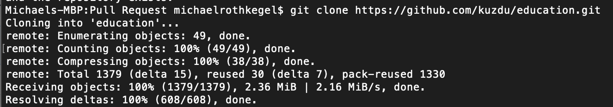
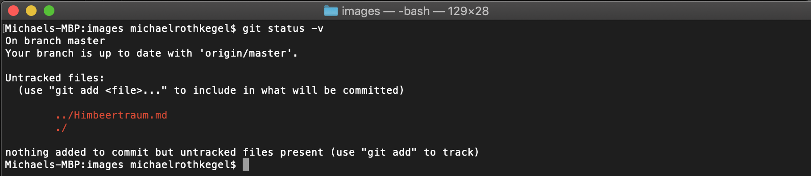
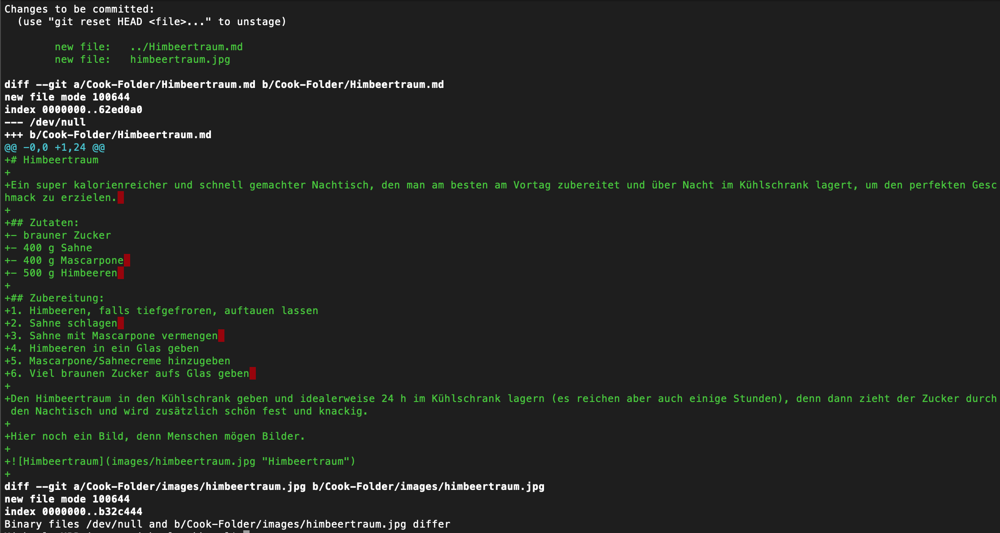
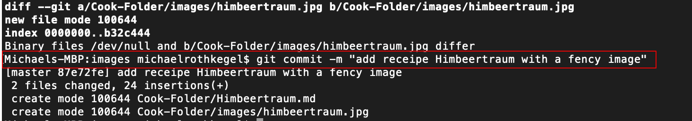
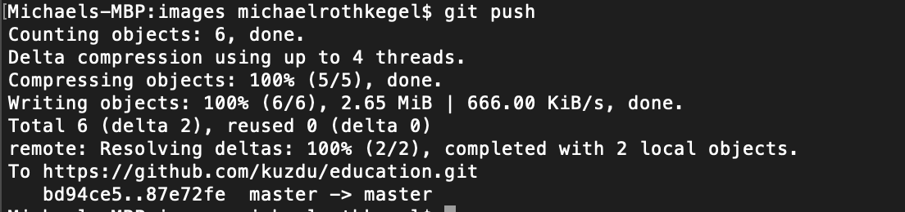

# Ein paar Git Commandos

Die folgenden Commandos sind bei dem Pull Request für (Bonus)Aufgabe 2 entstanden.

## 1. Clone 
Per Github habe ich das `education` geforked, so dass es in meinen Account ist. Anschließend habe ich es gecloned mittels `git clone https:\\ ...`

## 2. Änderungen 
Nach meinen Änderungen habe ich per Konsole kontrolliert, ob alles okay ist.  `git status -v` Es war nicht okay, weil ich die Files noch nicht getracked hatte.  

## 3. Hinzufügen 
Mittels `git add -A` habe ich alle erstellten Files getracked. Davon gibt es leider keinen Screenshot. 🤷‍♂️

## 4. Änderungen erneut überprüfen.  
Mittels `diff` oder `status` erneut überprüfen.

## 5. Alles commiten 
Mittles `git commit -m "Meine Message"` wurde alles commitet

## 6. Pushen
Mittles `git push` alles pushen 

## 😱
Es fehlen zwar einige Befehle, darüber bin ich mir bewusst. Ich kenne diese Befehle bzw. kann sie anwenden, zwar habe ich keine Beweise dafür, aber vielleicht glauben Sie mir ja. ✌️ 
