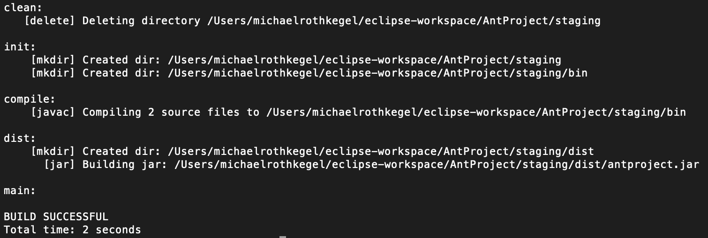
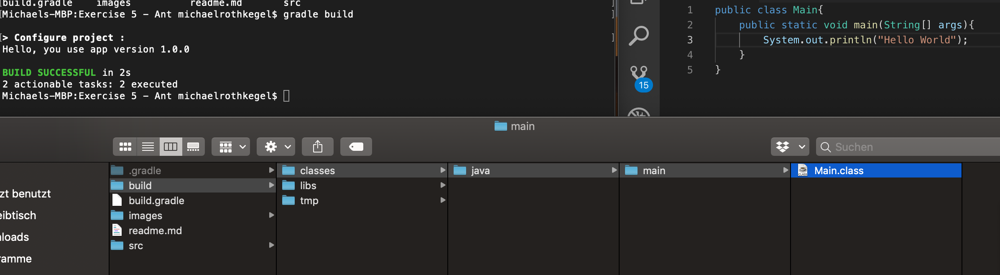
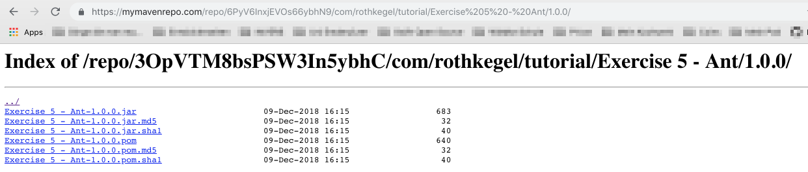

# Ant, Gradle & Maven

## Ant Script 
Ein eher unspektakuläres Ant Script, welches im Endeffekt einige Operationen auf ein Java (Hello World) Projekt ausführt.



Der dazugehörige Quellcode. 
```xml
<?xml version="1.0" encoding="UTF-8"?>

<project name="AntProject" default="main" basedir=".">
<description>
Description of your project
</description>

<property name="projectName" value="antproject" />  

<!--Staging Directory --> 
<property name="staging.dir" location="staging" />

<!-- Java sources -->
<property name="src.dir" location="src" />

<!-- Java classes -->
<property name="build.dir" location="${staging.dir}/bin" />

<!-- Output, Jar -->
<property name="dist.dir" location="${staging.dir}/dist" />

<target name="main" depends="clean, compile, dist" />

<target name="init">
<mkdir dir="${staging.dir}" />
<mkdir dir="${build.dir}" />
</target>

<target name="clean" description="Flush staging directory">
<delete dir="${staging.dir}" />   
</target>

<target name="compile" depends="init" description="compile the source ">
<javac includeantruntime="false" srcdir="${src.dir}" destdir="${build.dir}" />
</target>


<target name="dist" depends="compile" description="package, output to JAR">

<mkdir dir="${dist.dir}" />

<jar jarfile="${dist.dir}/${projectName}.jar" basedir="${build.dir}" >
<manifest>
<attribute name="Main-Class" value="${projectName}/AntProject" />
</manifest>
</jar>
</target>

</project>
```

## Gradle/Maven 
Eine Gradle, die Abhängigkeiten hat, welche von  `mavenCentral()` bezogen werden. In dem Dokument natürlich nicht korrekt, aber auf _https://mymavenrepo.com_ habe ich ein Maven Repository für bis zu 256 MB umsonst bekommen. Deshalb hat sogar ein Deployment funktioniert. 




Der dazugehörige Quellcode. 
```maven
group='com.rothkegel.tutorial'
version='1.0.0' 

apply plugin: 'java'
apply plugin: 'maven'

//for dependencies
repositories{ 
    mavenCentral() 
} 

dependencies{ 
    compile 'org.springframework:spring-context:4.3.5.RELEASE'
} 

task hello { 
    def version = '1.0.0'
    println "Hello, you use app version ${version}"
}

uploadArchives { 
    repositories { 
        mavenDeployer { 
            repository(url: 'www.myPathToMavenRepo.de') {   
            authentication(userName: 'xxxx', password: 'xxx'); } 
        } 
    } 
}
```
