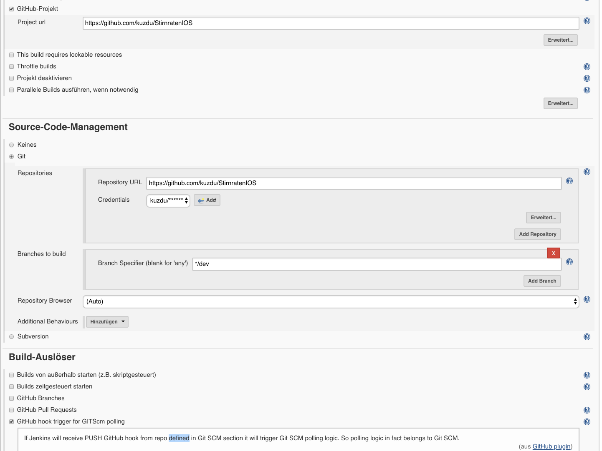
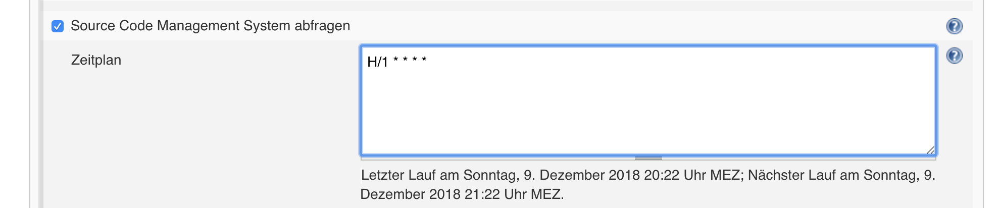
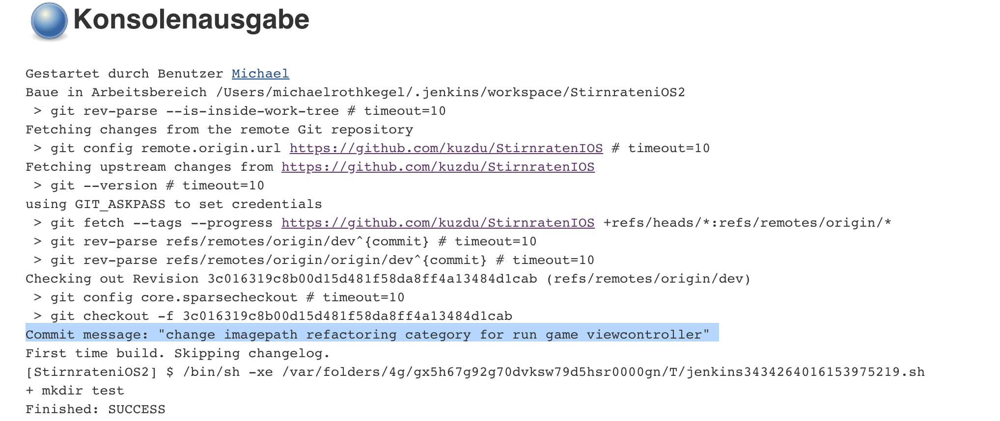
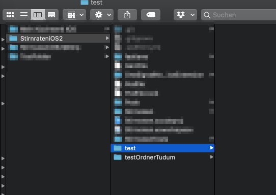

# Jenkins

Die Idee war es, ein Projekt so zu gestalten, dass nach einem Push auf mein Repository `StirnratenIOS` eine neue Version gebaut wird und eine Shell-Script ausgeführt wird, welches ein Deployment zum App Store ausführt. 

Die Abfolge wäre dann so gewesen
1. Push durchführen
2. Das Git Repository schickt an einen Webhook, dass ein Push Request eingegangen ist
3. Jenkins empfängt den Webhook und erledigt seine Aufgaben.

Dies funktionierte leider so nicht, da mein Jenkins Server natürlich nur lokal läuft und damit keine Webhooks, die Git sendet, empfangen kann. 

Stattdessen habe ich ein Cronjob eingerichtet, der jede Minute prüft, ob Änderungen vorliegen und ggf. baut. 

Naja schon zu viel Text, hier ein paar Screenshots. 

Ein Shellscript, welches am Ende ausgeführt wird. Es hat nichts mächtiges getan, sondern lediglich die Ordner `test` und `testOrderTutum` erstellt. 🙃

