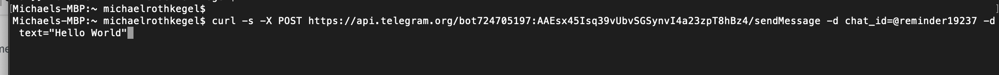
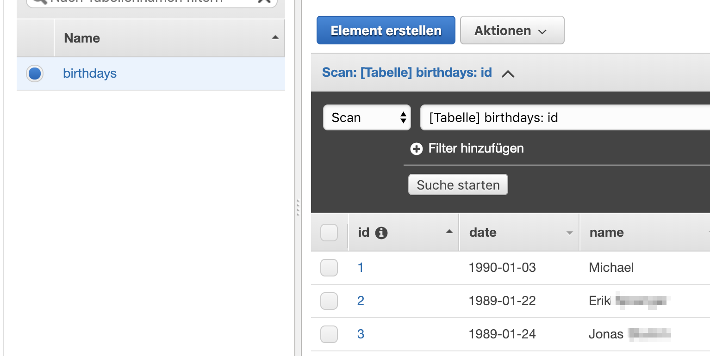
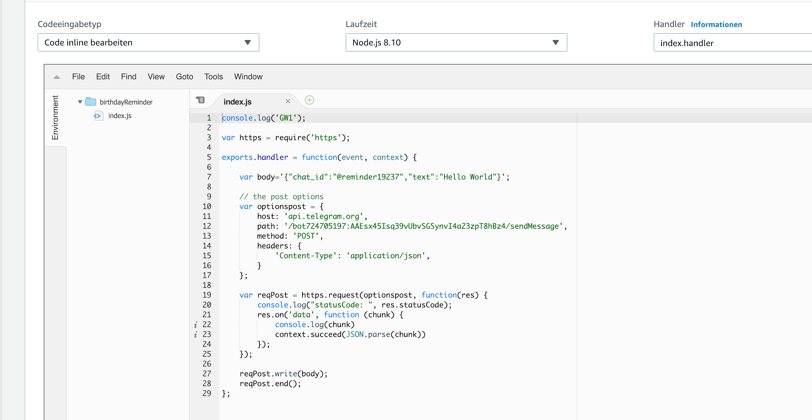
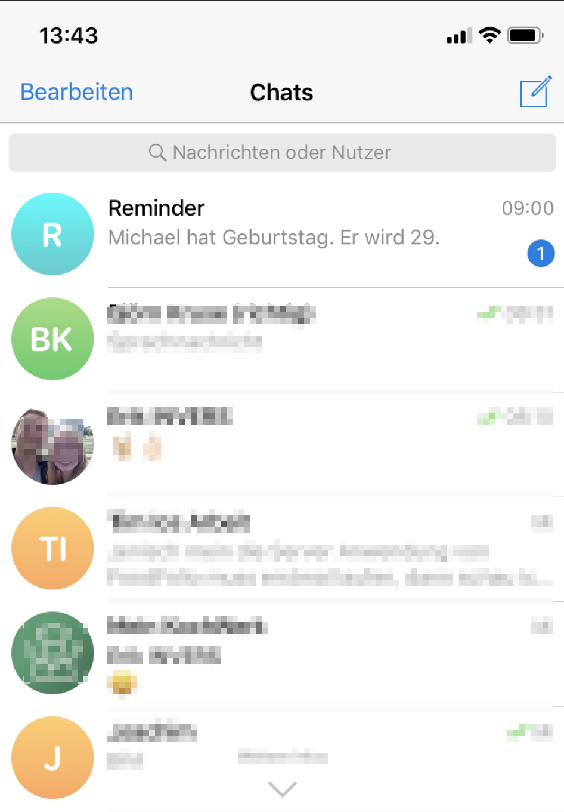

# Lamdba

Eine lustige Sache ist es geworden. Ich habe den Messenger Telegram (sowas wie WhatsApp in cool) verwendet, um einen Bot zu registrieren. 

Anschließend befülle ich eine DynamoDB (per Hand) mit Geburtstagsterminen. 

Diese Datenbank wird von einer lamda-Funktion mittels Cronjob einmal am Tag ausgelesen.

Es werden die Geburstage angesehen und falls ein Geburtstag am heutigen Tag ist, erhalte ich eine Push Notification mittels Telegram. 

